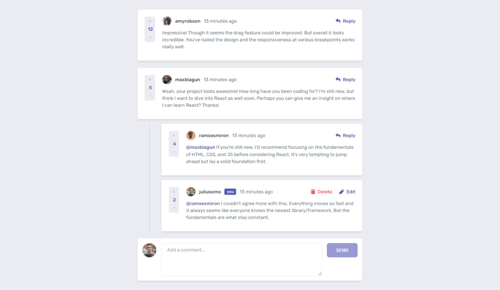
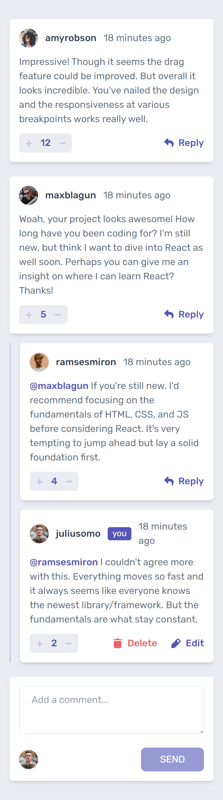

# Frontend Mentor - Interactive comments section solution

This is a solution to the [Interactive comments section challenge on Frontend Mentor](https://www.frontendmentor.io/challenges/interactive-comments-section-iG1RugEG9). Frontend Mentor challenges help you improve your coding skills by building realistic projects. 

## Table of contents

- [Overview](#overview)
  - [The challenge](#the-challenge)
  - [Screenshot](#screenshot)
  - [Links](#links)
- [My process](#my-process)
  - [Built with](#built-with)
- [Author](#author)

## Overview

### The challenge

Users should be able to:

- View the optimal layout for the app depending on their device's screen size
- See hover states for all interactive elements on the page
- Create, Read, Update, and Delete comments and replies
- Upvote and downvote comments
- **Bonus**: If you're building a purely front-end project, use `localStorage` to save the current state in the browser that persists when the browser is refreshed.
- **Bonus**: Instead of using the `createdAt` strings from the `data.json` file, try using timestamps and dynamically track the time since the comment or reply was posted.

### Screenshot

### Links

- Solution URL: [Github repo link](https://github.com/Clupai8o0/interactive-comments-section)
- Live Site URL: [Interactive Comments Section App | Frontend Mentor By Clupai8o0](https://clupai8o0.github.io/interactive-comments-section/)

## My process

### Built with

- Create react app
- Mobile-first workflow
- [React](https://reactjs.org/) - JS library
- [TailwindCSS](tailwindcss.com/) - For styles
- [RecoilJS](https://recoiljs.org/) - State management
- [Headless UI](headlessui.dev/) - For the Modal

## Author

- Frontend Mentor - [@Clupai8o0](https://www.frontendmentor.io/profile/Clupai8o0)
- Twitter - [@Clupai8o0](https://www.twitter.com/Clupai8o0)
- Github - [@Clupai8o0](https://github.com/Clupai8o0)
- Instagram - [@Shiki](https://instagram.com/shiki8o0)
